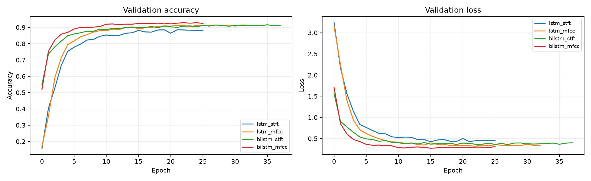

# Speech Command Recognition with CNNs and Recurrent Neural Networks

A comparison of convolutional and recurrent neural networks for classifying **35 spoken commands** from the [Google Speech Commands v0.02 dataset](https://www.tensorflow.org/datasets/catalog/speech_commands). The project explores two audio representations—**Short-Time Fourier Transform (STFT)** and **Mel-Frequency Cepstral Coefficients (MFCC)**—and includes a local microphone demo built with Gradio.

The best configuration in these experiments was **BiLSTM + MFCC**, reaching **91.79% test accuracy** and approximately **0.912 macro F1-score**.

## Project overview

The aim was to compare how feature representation and network architecture affect isolated-word recognition. I trained and evaluated six configurations using consistent dataset partitions:

- CNN with STFT and MFCC inputs
- LSTM with STFT and MFCC sequences
- Bidirectional LSTM (BiLSTM) with STFT and MFCC sequences

The project also includes a one-command terminal demo and an interactive dashboard for trying the trained models with a local microphone.

## Dataset and preprocessing

The experiments use **Google Speech Commands v0.02**, with 35 word classes. The notebooks use the dataset's official validation and testing lists to create fixed training, validation, and test partitions.

Audio is processed at **16 kHz** and standardized to **one-second** inputs by padding or trimming as needed. Two representations are extracted in `src/preprocessing.py`:

| Representation | Feature shape | Description |
|---|---|---|
| STFT | `(124, 129, 1)` | Time-frequency magnitude representation |
| MFCC | `(99, 13, 1)` | Compact cepstral representation of the audio spectrum |

CNN inputs are resized to **32 × 32** feature maps in the CNN training pipeline. The recurrent networks instead process the extracted features as sequences, without the trailing channel dimension.

The exploration notebook also illustrates background-noise augmentation. This should not be interpreted as a claim that augmentation was enabled in every training run; see the individual notebooks for the experimental settings.

## Experiments and results

| Architecture | Features | Test accuracy |
|---|---|---:|
| CNN | STFT | 82.24% |
| CNN | MFCC | 81.45% |
| LSTM | STFT | 86.02% |
| LSTM | MFCC | 90.32% |
| BiLSTM | STFT | 89.46% |
| **BiLSTM** | **MFCC** | **91.79%** |

**BiLSTM + MFCC** performed best in this comparison. The recurrent models generally outperformed the CNN baselines, and MFCC features worked particularly well with the LSTM and BiLSTM architectures. These observations apply to the dataset and experimental setup used here, rather than establishing a universally best architecture.

Detailed classification reports, confusion matrices, and training histories are available in [`results/cnn/`](results/cnn/) and [`results/rnn/`](results/rnn/).




## Repository structure

```text
.
├── app.py                         # Local Gradio microphone dashboard
├── demo.py                        # Single-command CNN + STFT terminal demo
├── environment.yml
├── requirements.txt
├── src/
│   └── preprocessing.py           # Shared STFT and MFCC extraction
├── notebooks/
│   ├── 01_data_exploration.ipynb
│   ├── 02_cnn_training.ipynb
│   └── 03_rnn_training.ipynb
├── data/
│   └── processed/                 # Manifest, labels, and summary CSVs
├── models/                        # Six saved Keras models and label metadata
└── results/
    ├── cnn/                       # CNN metrics and confusion matrices
    └── rnn/                       # Recurrent-model metrics and figures
```

The original audio dataset is **not included** in the repository.

## Installation

Python **3.11** is recommended. From the repository root:

```bash
conda env create -f environment.yml
conda activate speech-command-recognition
```

Alternatively, install the Python packages in an existing Python 3.11 environment:

```bash
pip install -r requirements.txt
```

The microphone demos require a working audio input device and the system audio libraries needed by `sounddevice`. On Ubuntu, you may need to install PortAudio through your package manager.

> **Note:** Make sure `requirements.txt` includes `gradio`, `sounddevice`, and `scikit-learn` (used in the evaluation notebooks). CPU-only TensorFlow installation is sufficient for running the demos; GPU support is optional.

## Run the demos

### Gradio dashboard

```bash
python app.py
```

Open the local URL printed in the terminal (usually `http://127.0.0.1:7860`). Select a model, click **Start listening**, and say one command at a time with a short pause between words.

The dashboard provides model selection, a recent waveform, the top five predictions, and a history of detected commands. **The microphone is captured by the Python process on the same computer running `app.py`**, not by a remote visitor's browser. The app is intended for local use.

### Terminal demo

```bash
python demo.py
```

Press **Enter** to record one second of audio. This simpler demo uses the saved **CNN + STFT** model and prints its top predictions.

## Reproducing the experiments

1. Download and extract [Speech Commands v0.02](https://download.tensorflow.org/data/speech_commands_v0.02.tar.gz) to `data/raw/speech_commands_v0.02/`.
2. Run `notebooks/01_data_exploration.ipynb` to explore the data and create the dataset manifest.
3. Run `notebooks/02_cnn_training.ipynb` for the CNN experiments.
4. Run `notebooks/03_rnn_training.ipynb` for the LSTM/BiLSTM experiments and model comparison.

Training times and exact metrics can vary with hardware and environment. The saved `.keras` files allow the demos to run without retraining.

## Limitations

- **Offline evaluation is not live microphone accuracy.** Test metrics were obtained on held-out dataset recordings.
- The Gradio app uses an **energy-based speech detector**, not a trained voice-activity detector. Background noise and silence can still trigger classifications.
- The **70% confidence threshold** in the live app is heuristic and is not a calibrated rejection mechanism for unknown words.
- The BiLSTM processes a buffered command; it is **not** a frame-by-frame streaming speech recognition model.

Potential improvements include a dedicated voice-activity detector, more robust noise handling, and evaluation on recordings from different microphones and environments.

## Technologies

Python · TensorFlow / Keras · NumPy · SciPy · `python_speech_features` · scikit-learn · Matplotlib · Gradio · `sounddevice`
